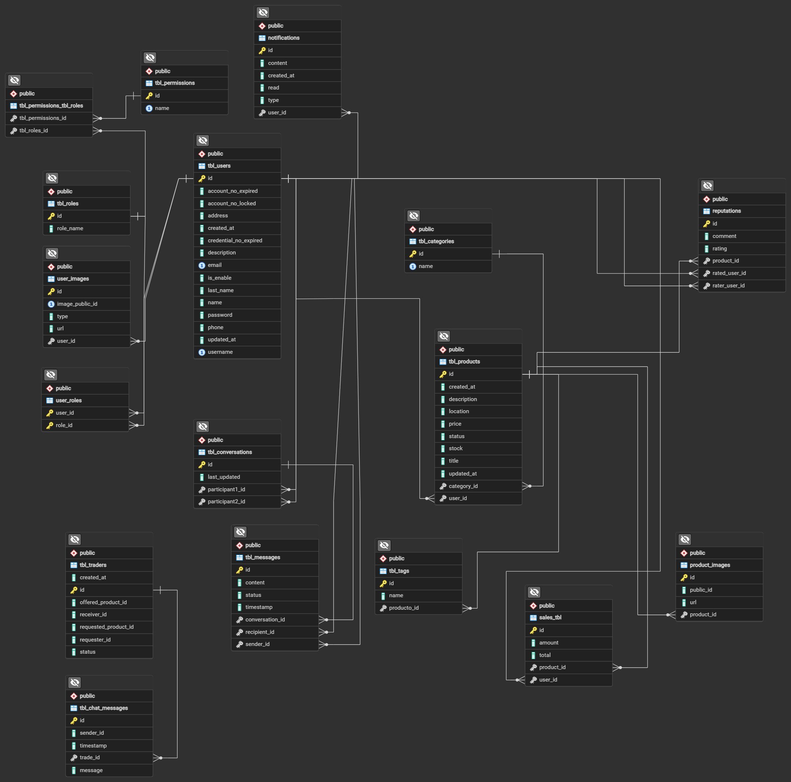

# 🛒 API Marketplace

Aplicación backend desarrollada con **Spring Boot** que permite a los usuarios intercambiar productos mediante un sistema de trueques, autenticación segura con **JWT** y gestión de permisos basada en roles.  
El proyecto utiliza **PostgreSQL** como base de datos y **Cloudinary** para el almacenamiento de imágenes.

---

## 🚀 Tecnologías principales

| Categoría | Tecnologías |
|------------|-------------|
| Lenguaje | Java 21 |
| Framework | Spring Boot 3 (Spring Web, Spring Security, Spring Data JPA) |
| Autenticación | JWT (JSON Web Token) |
| Base de datos | PostgreSQL |
| ORM | JPA / Hibernate |
| Almacenamiento de imágenes | Cloudinary |
| Validación | Jakarta Validation (`@Valid`) |
| Herramientas | Maven,  Git |

---

## 🧩 Arquitectura del sistema

El sistema sigue una **arquitectura en capas**:

Controller → Service → Repository → Entity


Cada capa cumple una función clara:
- **Controller:** maneja las peticiones HTTP.
- **Service:** contiene la lógica de negocio.
- **Repository:** gestiona el acceso a datos con JPA.
- **Entity:** representa las tablas de la base de datos.

Además, se utiliza un sistema de **DTOs** para separar las entidades del modelo de datos expuesto por la API.

---

## 🔐 Autenticación y permisos

El sistema utiliza **JWT (JSON Web Tokens)** para la autenticación.

### Funcionalidades:
- Registro y login de usuarios.
- Emisión y validación de tokens JWT.
- Roles y permisos para control de acceso.

Ejemplo de roles:
- **ROLE_USER:** puede publicar, editar o eliminar sus productos.
- **ROLE_ADMIN:** puede gestionar usuarios y moderar publicaciones.

---

## ☁️ Integración con Cloudinary

Cada usuario puede subir imágenes de productos, que se almacenan externamente en **Cloudinary**.

- Las imágenes se suben mediante un `MultipartFile`.
- Se almacena en la base de datos solo la **URL** devuelta por Cloudinary.
- Configuración sencilla desde `application.yml`:


### Endpoints principales

| Método | Endpoint | Descripción | Requiere Auth |
|--------|-----------|--------------|----------------|
| POST | `/api/auth/register` | Registrar usuario | ❌ |
| POST | `/api/auth/login` | Iniciar sesión | ❌ |
| GET | `/api/products` | Listar productos | ❌ |
| POST | `/api/products` | Crear producto | ✅ |
| DELETE | `/api/products/{id}` | Eliminar producto propio | ✅ |
| GET | `/api/users/me` | Perfil de usuario autenticado | ✅ |

#Configuración 
### 🧰 Requisitos previos

- Java 21 o superior
- Maven 3.9+
- PostgreSQL (en ejecución)
- Cuenta en Cloudinary (para gestión de imágenes)
- Git

### ⚙️ Variables de entorno requeridas

Crea un archivo `.env` o usa variables del sistema con los siguientes valores:

| Variable | Descripción |
|-----------|-------------|
| `DB_URL` | URL de conexión a la base de datos PostgreSQL |
| `DB_USER` | Usuario de la base de datos |
| `DB_PASSWORD` | Contraseña de la base de datos |
| `JWT_SECRET` | Clave secreta usada para firmar tokens JWT |
| `JWT_EXPIRATION` | Tiempo de expiración del token (en milisegundos) |
| `CLOUD_NAME` | Nombre de tu cuenta Cloudinary |
| `CLOUD_API_KEY` | API Key de Cloudinary |
| `CLOUD_API_SECRET` | API Secret de Cloudinary |

### 🧭 Diagrama del modelo de datos




## 🧰 Cómo ejecutar el proyecto
1. Clona el repositorio:
   ```bash
   git clone https://github.com/tu-usuario/marketplace-backend.git
   cd marketplace-backend
   
2. Configura tus variables de entorno o .env.

3. Compila y ejecuta con Maven:
	mvn spring-boot:run

4. Accede a la API:
	http://localhost:8080
	
## 👨‍💻 Autor

**José Silva**  
Desarrollador Backend — Java / Spring Boot  
[LinkedIn](www.linkedin.com/in/josesilvap) | [GitHub](https://github.com/JSE123)
